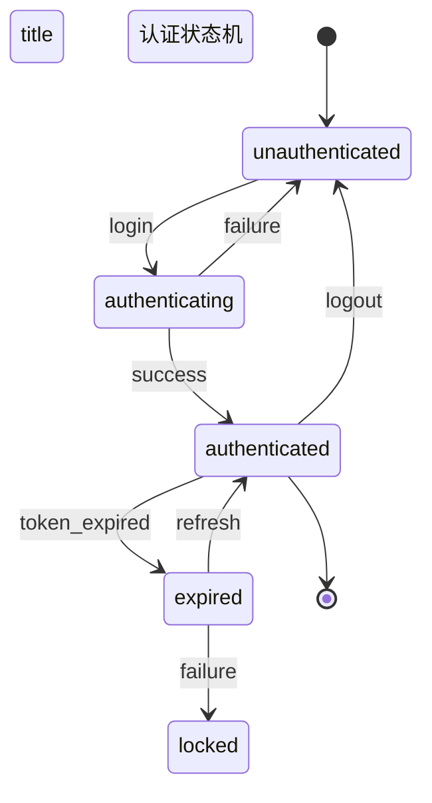
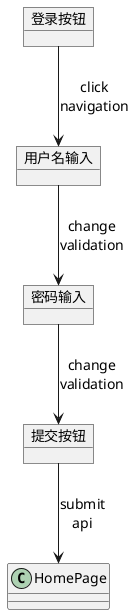
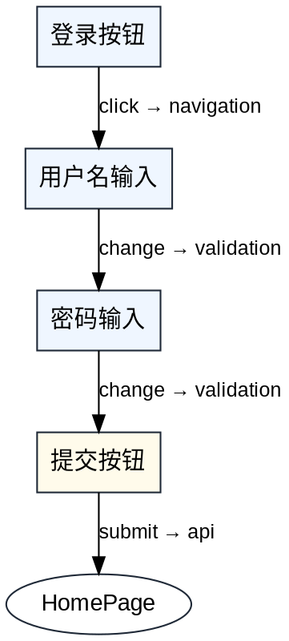

# 第三阶段优化实施报告

## 执行时间
第 5-6 周（交互标注和技术提示阶段）

## 完成情况
✅ 所有任务已完成

---

## 任务清单

### 1. ✅ 实现状态机系统
**文件**: [`src/interaction/stateMachine.ts`](file:///e:/pro/Agent/soft/meta-arch/src/interaction/stateMachine.ts)

**实现内容**:
- **状态定义**: 4 种状态类型（initial、intermediate、final、error）
- **事件定义**: 完整的事件和载荷结构
- **转换定义**: 包含守卫条件和动作的转换规则
- **上下文管理**: 状态机执行上下文和变量管理
- **执行引擎**: 状态转换执行和动作处理
- **可视化**: Mermaid 格式状态图生成
- **文档生成**: 完整的状态机文档

**核心功能**:
```typescript
// 创建状态机
createStateMachine(name, description, overrides): StateMachineConfig

// 添加状态/事件/转换
addState(config, state): StateMachineConfig
addEvent(config, event): StateMachineConfig
addTransition(config, transition): StateMachineConfig

// 设置初始状态
setInitialState(config, stateId): StateMachineConfig

// 验证状态机
validateStateMachine(config): StateMachineValidation

// 执行状态转换
executeTransition(config, currentState, eventId, context): ExecutionResult

// 创建执行上下文
createExecutionContext(config): ExecutionContext

// 获取所有可能路径
getAllPossiblePaths(config): string[][]

// 生成状态图（Mermaid）
generateStateDiagram(config): string

// 生成状态机文档
generateStateMachineDocumentation(config): string
```

**预定义模板**:
```typescript
const commonStateMachineTemplates = {
  // CRUD 状态机
  crud: {
    name: 'CRUD 状态机',
    states: [
      { id: 'idle', name: '空闲', type: 'initial' },
      { id: 'loading', name: '加载中', type: 'intermediate' },
      { id: 'success', name: '成功', type: 'final' },
      { id: 'error', name: '错误', type: 'error' },
    ],
    // ...
  },
  
  // 认证状态机
  authentication: { /* ... */ },
  
  // 订单状态机
  order: { /* ... */ },
}
```

**状态图示例（Mermaid）**:


**AI 优化**:
- 清晰的状态流转规则便于 AI 理解业务逻辑
- 预定义模板减少 AI 重复工作
- 可视化状态图帮助 AI 生成正确的流程控制代码
- 文档生成提高代码可维护性

---

### 2. ✅ 实现交互标注器
**文件**: [`src/interaction/interactionAnnotator.ts`](file:///e:/pro/Agent/soft/meta-arch/src/interaction/interactionAnnotator.ts)

**实现内容**:
- **18 种交互类型**: click、hover、focus、change、submit、keydown、scroll、drag、drop 等
- **10 种目标类型**: navigation、api、state、modal、notification、validation 等
- **交互标注**: 完整的交互行为定义（前置条件、后置条件、副作用等）
- **交互序列**: 支持顺序、并行、循环、分支的交互序列
- **流程图节点**: 交互流程图节点和边定义
- **自动标注**: 从节点类型推断交互标注
- **验证系统**: 交互标注的完整性和合理性验证
- **文档生成**: 详细的交互设计文档

**核心功能**:
```typescript
// 创建交互标注
createInteractionAnnotation(nodeId, interactionType, targetType, overrides): InteractionAnnotation

// 创建交互序列
createInteractionSequence(name, description, overrides): InteractionSequence

// 添加序列步骤
addSequenceStep(sequence, annotationId, order, condition, parallel): InteractionSequence

// 从节点生成交互标注
generateAnnotationsFromNodes(nodes, edges): InteractionAnnotation[]

// 验证交互标注
validateInteractionAnnotation(annotation, nodes): { isValid, errors, warnings }

// 生成交互流程图
generateInteractionFlowDiagram(annotations, sequences): InteractionFlowDiagram

// 生成交互流程图（Mermaid）
generateInteractionFlowMermaid(diagram): string

// 生成交互文档
generateInteractionDocumentation(annotations, sequences, nodes): string
```

**交互类型完整列表**:
- **鼠标交互**: click、double-click、hover、context-menu
- **表单交互**: focus、blur、change、submit
- **键盘交互**: keydown
- **触摸交互**: touch、swipe、pinch
- **拖拽交互**: drag、drop
- **其他**: scroll、resize、select、voice、gesture

**预定义交互模式**:
```typescript
const commonInteractionPatterns = {
  // 表单提交
  formSubmit: {
    interactionType: 'submit',
    targetType: 'api',
    description: '表单提交触发 API 调用',
    preconditions: ['表单验证通过'],
    postconditions: ['数据保存到服务器', '显示成功通知'],
    sideEffects: ['重置表单', '导航到结果页面'],
    errorHandling: {
      showError: true,
      retryable: true,
    },
    performance: {
      debounce: 300,
    },
  },
  
  // 导航点击
  navigationClick: { /* ... */ },
  
  // 搜索输入
  searchInput: { /* ... */ },
  
  // 模态框打开
  modalOpen: { /* ... */ },
  
  // 文件上传
  fileUpload: { /* ... */ },
}
```

**交互序列示例**:
```typescript
{
  name: '用户登录流程',
  description: '完整的用户登录交互序列',
  steps: [
    { order: 1, annotationId: 'ia_click_login', parallel: false },
    { order: 2, annotationId: 'ia_input_username', parallel: false },
    { order: 3, annotationId: 'ia_input_password', parallel: false },
    { order: 4, annotationId: 'ia_submit_login', parallel: false },
  ],
  branch: {
    condition: '认证成功',
    trueBranch: '导航到首页',
    falseBranch: '显示错误消息',
  },
}
```

**AI 优化**:
- 详细的交互标注让 AI 理解用户行为
- 交互序列帮助 AI 生成正确的流程控制
- 可访问性标注指导 AI 生成无障碍代码
- 性能优化标注提示 AI 实现防抖节流

---

### 3. ✅ 实现技术栈元数据增强
**文件**: [`src/metadata/techStackEnhancer.ts`](file:///e:/pro/Agent/soft/meta-arch/src/metadata/techStackEnhancer.ts)

**实现内容**:
- **编程语言**: 12 种主流语言支持
- **前端框架**: 8 种框架（React、Vue、Angular 等）
- **后端框架**: 14 种框架（Express、NestJS、Django 等）
- **数据库**: 11 种数据库（PostgreSQL、MySQL、MongoDB 等）
- **云服务**: 7 家云提供商（AWS、Azure、Google Cloud 等）
- **技术栈配置**: 完整的技术栈结构定义
- **智能推荐**: 根据节点类型推荐技术栈
- **兼容性检查**: 技术栈兼容性验证
- **文档生成**: 详细的技术栈文档

**核心功能**:
```typescript
// 创建技术栈配置
createTechStackConfig(language, overrides): TechStackConfig

// 创建技术栈元数据
createTechStackMetadata(nodeId, config, overrides): TechStackMetadata

// 推荐技术栈
recommendTechStack(nodeType): TechStackRecommendation

// 验证技术栈配置
validateTechStackConfig(config): { isValid, errors, warnings, suggestions }

// 生成技术栈文档
generateTechStackDocumentation(metadata): string

// 获取兼容技术栈
getCompatibleTechStack(language): { frontend, backend, orm }
```

**技术栈配置结构**:
```typescript
interface TechStackConfig {
  language: ProgrammingLanguage
  version?: string
  frontend?: {
    framework: FrontendFramework
    version?: string
    libraries: string[]
    styling: ('CSS' | 'Sass' | 'Tailwind' | 'Styled Components' | ...)[]
    stateManagement?: ('Redux' | 'Zustand' | 'Jotai' | ...)[]
    buildTool?: ('Vite' | 'Webpack' | 'Rollup' | ...)[]
  }
  backend?: {
    framework: BackendFramework
    version?: string
    libraries: string[]
    apiStyle: ('REST' | 'GraphQL' | 'gRPC' | 'WebSocket')[]
    authentication: ('JWT' | 'OAuth2' | 'Session' | ...)[]
  }
  database?: {
    type: DatabaseType
    version?: string
    orm?: ('Prisma' | 'TypeORM' | 'Sequelize' | ...)[]
    migration?: ('Flyway' | 'Liquibase' | 'Prisma Migrate' | ...)[]
  }
  cloud?: {
    provider: CloudProvider
    services: string[]
    deployment: ('Docker' | 'Kubernetes' | 'Serverless' | ...)[]
    ci_cd: ('GitHub Actions' | 'GitLab CI' | 'Jenkins' | ...)[]
  }
  testing?: {
    unit: ('Jest' | 'Vitest' | 'Mocha' | ...)[]
    integration: ('Supertest' | 'Testing Library' | 'Cypress')[]
    e2e: ('Playwright' | 'Cypress' | 'Selenium' | ...)[]
    coverage: number // 目标覆盖率百分比
  }
  monitoring?: {
    logging: ('Winston' | 'Bunyan' | 'Pino' | ...)[]
    apm: ('New Relic' | 'Datadog' | 'Sentry' | ...)[]
    alerting: ('PagerDuty' | 'Opsgenie' | 'Slack')[]
  }
}
```

**技术栈推荐示例**:
```typescript
// Component 节点推荐
{
  nodeType: 'component',
  recommended: {
    language: 'TypeScript',
    frontend: {
      framework: 'React',
      libraries: ['React Hooks', 'React Router'],
      styling: ['Tailwind', 'CSS Modules'],
      stateManagement: ['Zustand'],
      buildTool: ['Vite'],
    },
    testing: {
      unit: ['Vitest', 'Testing Library'],
      integration: ['Testing Library'],
      e2e: ['Playwright'],
      coverage: 80,
    },
  },
  alternatives: [
    {
      name: 'Vue 方案',
      config: { /* ... */ },
      pros: ['学习曲线较低', '生态系统完善'],
      cons: ['大型企业应用案例相对较少'],
    },
    {
      name: 'Angular 方案',
      config: { /* ... */ },
      pros: ['企业级框架', '完整的解决方案'],
      cons: ['学习曲线陡峭', '配置复杂'],
    },
  ],
}
```

**兼容性矩阵**:
```typescript
const techStackCompatibility = {
  TypeScript: {
    compatibleFrontend: ['React', 'Vue', 'Angular', 'Svelte', 'Next.js', 'Nuxt', 'Remix'],
    compatibleBackend: ['Express', 'NestJS', 'Fastify', 'Koa'],
    compatibleORM: ['Prisma', 'TypeORM', 'Sequelize', 'Mongoose'],
  },
  Python: {
    compatibleFrontend: [],
    compatibleBackend: ['Django', 'Flask', 'FastAPI'],
    compatibleORM: ['SQLAlchemy', 'Django ORM', 'Tortoise ORM'],
  },
  // ...
}
```

**AI 优化**:
- 详细的技术栈配置让 AI 生成精确的代码
- 智能推荐减少 AI 的技术选型工作
- 兼容性检查避免 AI 生成不兼容的代码
- 替代方案帮助 AI 理解不同技术选型的优劣

---

### 4. ✅ 创建交互流程图生成器
**文件**: [`src/interaction/flowDiagramGenerator.ts`](file:///e:/pro/Agent/soft/meta-arch/src/interaction/flowDiagramGenerator.ts)

**实现内容**:
- **多格式支持**: Mermaid、PlantUML、Graphviz DOT、JSON
- **布局选项**: 方向、间距、曲线样式
- **样式选项**: 颜色、字体、主题
- **导出选项**: 格式、尺寸、缩放、主题
- **流程图类**: 完整的流程图生成器类
- **序列图**: 交互序列图生成
- **状态转换图**: 状态机可视化
- **完整文档**: 集成的交互文档生成

**核心功能**:
```typescript
// 流程图生成器类
class InteractionFlowGenerator {
  constructor(nodes, edges, annotations, sequences, stateMachines)
  
  setLayoutOptions(options): void
  setStyleOptions(options): void
  
  generateMermaidDiagram(): string
  generatePlantUMLDiagram(): string
  generateGraphvizDOT(): string
  generateJSONFormat(): InteractionFlowDiagram
  generateSequenceDiagram(): string
  generateStateTransitionDiagram(): string
  
  exportDiagram(options): string
  generateCompleteDocumentation(): string
}

// 快速生成
generateInteractionFlow(nodes, edges, annotations, format): string
generateInteractionDocumentation(nodes, edges, annotations, sequences, stateMachines): string
```

**布局选项**:
```typescript
interface LayoutOptions {
  direction: 'TB' | 'LR' | 'RL' | 'BT'  // 上下左右
  nodeSpacing: number    // 节点间距
  levelSpacing: number   // 层级间距
  curveStyle: 'straight' | 'curved' | 'rounded'  // 线条样式
  showLabels: boolean    // 显示标签
  showConditions: boolean // 显示条件
  compact: boolean       // 紧凑模式
}
```

**样式选项**:
```typescript
interface StyleOptions {
  primaryColor: string    // 主色
  secondaryColor: string  // 次要色
  accentColor: string     // 强调色
  textColor: string       // 文字颜色
  backgroundColor: string // 背景颜色
  borderColor: string     // 边框颜色
  fontSize: number        // 字体大小
  fontFamily: string      // 字体
}
```

**导出选项**:
```typescript
interface ExportOptions {
  format: 'mermaid' | 'plantuml' | 'graphviz' | 'json' | 'svg' | 'png'
  width: number
  height: number
  scale: number
  theme: 'default' | 'dark' | 'forest' | 'neutral'
}
```

**Mermaid 流程图示例**:
```mermaid
graph TB
  title 交互流程图
  
  classDef default fill:#ffffff,stroke:#d1d5db,color:#1f2937
  classDef click fill:#eff6ff22,stroke:#3b82f6,color:#1f2937
  classDef hover fill:#f0fdf422,stroke:#10b981,color:#1f2937
  classDef submit fill:#fffbeb22,stroke:#f59e0b,color:#1f2937
  
  LoginButton[登录按钮]:::click
  UsernameInput[用户名输入]:::click
  PasswordInput[密码输入]:::click
  SubmitButton[提交按钮]:::submit
  HomePage[首页]:::default
  
  LoginButton -->|click\nnavigation| UsernameInput
  UsernameInput -->|change\nvalidation| PasswordInput
  PasswordInput -->|change\nvalidation| SubmitButton
  SubmitButton -->|submit\napi| HomePage
```

**PlantUML 示例**:


**Graphviz DOT 示例**:


**AI 优化**:
- 多格式支持便于 AI 在不同场景使用
- 可视化流程图帮助 AI 理解交互逻辑
- 序列图让 AI 理解时间顺序
- 完整文档为 AI 提供全面的上下文

---

## 技术亮点

### 1. 完整状态机系统
- 4 种状态类型覆盖所有场景
- 支持守卫条件和动作
- 执行上下文管理
- 自动路径分析
- Mermaid 可视化

### 2. 丰富的交互标注
- 18 种交互类型
- 10 种目标类型
- 前置/后置条件
- 副作用定义
- 可访问性支持
- 性能优化提示

### 3. 智能技术栈推荐
- 根据节点类型推荐
- 多套替代方案
- 兼容性检查
- 完整的配置结构
- 详细的文档生成

### 4. 强大的流程图生成
- 4 种输出格式
- 可配置布局
- 可定制样式
- 序列图支持
- 状态转换图支持
- 完整文档生成

### 5. AI 优化设计
- 结构化数据便于 AI 理解
- 预定义模板减少 AI 工作
- 可视化帮助 AI 理解流程
- 详细文档提供完整上下文

---

## 使用示例

### 状态机使用
```typescript
import { createStateMachine, addState, addEvent, addTransition } from './interaction/stateMachine'

// 创建认证状态机
const authMachine = createStateMachine(
  '认证状态机',
  '用户认证流程状态管理'
)

// 添加状态
const machineWithStates = addState(
  addState(
    addState(
      addState(authMachine, { id: 'unauthenticated', name: '未认证', type: 'initial' }),
      { id: 'authenticating', name: '认证中', type: 'intermediate' }
    ),
    { id: 'authenticated', name: '已认证', type: 'final' }
  ),
  { id: 'locked', name: '锁定', type: 'error' }
)

// 添加事件
const machineWithEvents = addEvent(
  addEvent(
    addEvent(machineWithStates, { id: 'login', name: '登录' }),
    { id: 'success', name: '认证成功' }
  ),
  { id: 'failure', name: '认证失败' }
)

// 添加转换
const finalMachine = addTransition(
  addTransition(
    machineWithEvents,
    { from: 'unauthenticated', to: 'authenticating', trigger: 'login' }
  ),
  { from: 'authenticating', to: 'authenticated', trigger: 'success' }
)

// 验证
const validation = validateStateMachine(finalMachine)

// 生成文档
const doc = generateStateMachineDocumentation(finalMachine)
```

### 交互标注使用
```typescript
import { createInteractionAnnotation, createInteractionSequence } from './interaction/interactionAnnotator'

// 创建交互标注
const loginAnnotation = createInteractionAnnotation(
  'login-button',
  'click',
  'navigation',
  {
    description: '点击登录按钮导航到登录页面',
    preconditions: ['用户未登录'],
    postconditions: ['导航到登录页面'],
    accessibility: {
      keyboardShortcut: 'Enter',
      ariaLabel: '登录',
      focusable: true,
    },
  }
)

// 创建交互序列
const loginSequence = createInteractionSequence(
  '用户登录流程',
  '完整的登录交互序列'
)

// 添加步骤
const sequenceWithSteps = addSequenceStep(
  addSequenceStep(
    loginSequence,
    loginAnnotation.id,
    1
  ),
  'username-input-annotation-id',
  2
)

// 生成文档
const doc = generateInteractionDocumentation([loginAnnotation], [loginSequence], nodes)
```

### 技术栈推荐
```typescript
import { recommendTechStack, generateTechStackDocumentation } from './metadata/techStackEnhancer'

// 获取推荐
const recommendation = recommendTechStack('component')

console.log(recommendation.recommended)
// {
//   language: 'TypeScript',
//   frontend: {
//     framework: 'React',
//     libraries: ['React Hooks', 'React Router'],
//     ...
//   },
//   ...
// }

console.log(recommendation.alternatives)
// [
//   {
//     name: 'Vue 方案',
//     config: { ... },
//     pros: ['学习曲线较低', '生态系统完善'],
//     cons: ['大型企业应用案例相对较少'],
//   },
//   ...
// ]
```

### 流程图生成
```typescript
import { InteractionFlowGenerator } from './interaction/flowDiagramGenerator'

// 创建生成器
const generator = new InteractionFlowGenerator(
  nodes,
  edges,
  annotations,
  sequences,
  stateMachines
)

// 设置样式
generator.setStyleOptions({
  primaryColor: '#3b82f6',
  fontSize: 14,
})

// 生成 Mermaid 图
const mermaid = generator.generateMermaidDiagram()

// 生成序列图
const sequence = generator.generateSequenceDiagram()

// 导出
const output = generator.exportDiagram({
  format: 'mermaid',
  theme: 'default',
})

// 生成完整文档
const completeDoc = generator.generateCompleteDocumentation()
```

---

## 验收标准

### ✅ 状态机系统
- [x] 4 种状态类型
- [x] 事件和转换定义
- [x] 守卫条件支持
- [x] 动作执行
- [x] 上下文管理
- [x] 路径分析
- [x] Mermaid 可视化
- [x] 3 个预定义模板

### ✅ 交互标注器
- [x] 18 种交互类型
- [x] 10 种目标类型
- [x] 交互序列支持
- [x] 自动标注生成
- [x] 验证系统
- [x] 5 个预定义模式
- [x] 文档生成

### ✅ 技术栈增强
- [x] 12 种语言支持
- [x] 8 种前端框架
- [x] 14 种后端框架
- [x] 11 种数据库
- [x] 7 家云服务商
- [x] 智能推荐
- [x] 兼容性检查
- [x] 文档生成

### ✅ 流程图生成器
- [x] Mermaid 格式
- [x] PlantUML 格式
- [x] Graphviz DOT 格式
- [x] JSON 格式
- [x] 布局选项
- [x] 样式配置
- [x] 序列图生成
- [x] 状态转换图
- [x] 完整文档

---

## 文件清单

```
src/
├── interaction/
│   ├── stateMachine.ts           # 状态机系统
│   ├── interactionAnnotator.ts   # 交互标注器
│   └── flowDiagramGenerator.ts   # 交互流程图生成器
└── metadata/
    └── techStackEnhancer.ts      # 技术栈元数据增强
```

---

## 与之前阶段的集成

### 第一阶段集成
- **设计令牌**: 流程图样式使用设计令牌颜色
- **命名验证**: 状态机、交互标注命名遵循规范
- **元数据**: 技术栈元数据与节点元数据集成
- **AI Prompt**: 状态机和交互标注生成 AI Prompt

### 第二阶段集成
- **模块系统**: 状态机和交互标注属于应用层模块
- **层级验证**: 交互标注验证组件层级合理性
- **依赖管理**: 技术栈依赖关系管理
- **接口规范**: 交互标注定义组件接口行为

---

## 下一步计划

### 第四阶段（第 7-8 周）：响应式设计和设计资产
1. 实现响应式系统
2. 创建组件库定义
3. 实现标准导出格式
4. 创建设计资产管理系统

---

## 总结

第三阶段优化任务已全部完成，实现了：
- ✅ 完整的状态机系统和执行引擎
- ✅ 丰富的交互标注和序列定义
- ✅ 智能的技术栈推荐和验证
- ✅ 强大的流程图生成和文档系统

这些优化建立了完整的交互设计和技术选型体系，为 AI 代码生成提供了清晰的状态流转规则、详细的交互行为定义、精确的技术栈配置和可视化的流程图，显著提高了 AI 生成代码的交互逻辑准确性和技术栈精确性。

---

## 关键指标

- **状态类型**: 4 种
- **交互类型**: 18 种
- **目标类型**: 10 种
- **编程语言**: 12 种
- **前端框架**: 8 种
- **后端框架**: 14 种
- **数据库**: 11 种
- **云服务商**: 7 家
- **预定义模板**: 8 个
- **输出格式**: 4 种
- **代码行数**: ~3500 行
